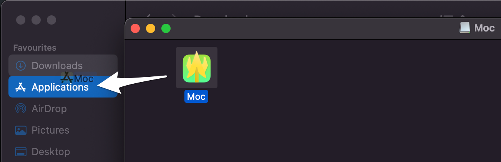
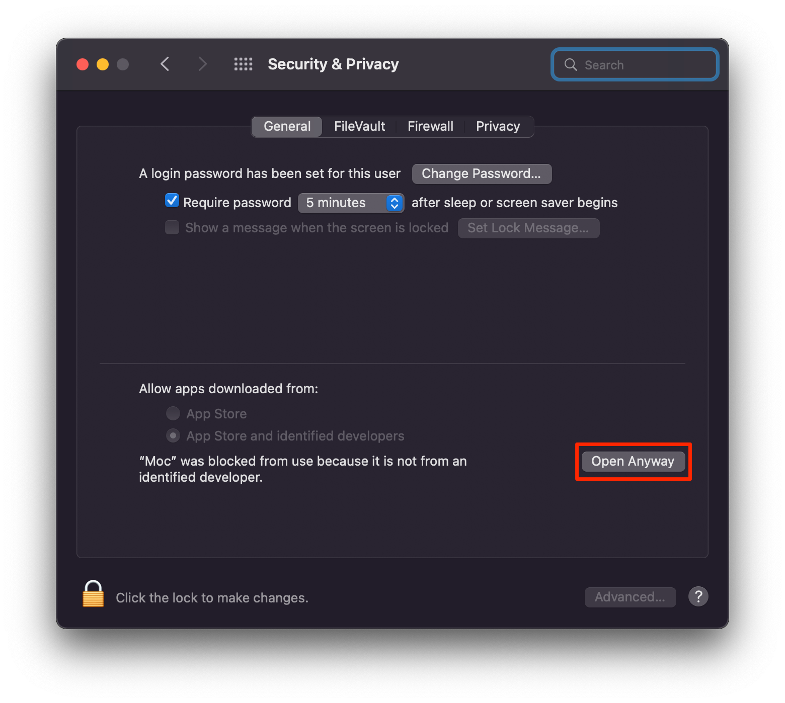

# Installation

App distrubuted as an unsigned binary, so you will need to mitigate some MacOS warnings to start the app.

1. Download Release.
You can find latest release at [Releases page](https://github.com/ggoraa/moc/releases)

2. Unzip archive and double-click Moc.dmg

3. Move Moc to Applications folder

4. Double-click Moc.app

5. MacOS will warn you that "Moc" cannnot be opened.

6. Go to System Preferences > Security & Privacy. Click "Open Anyway" > "Open"

