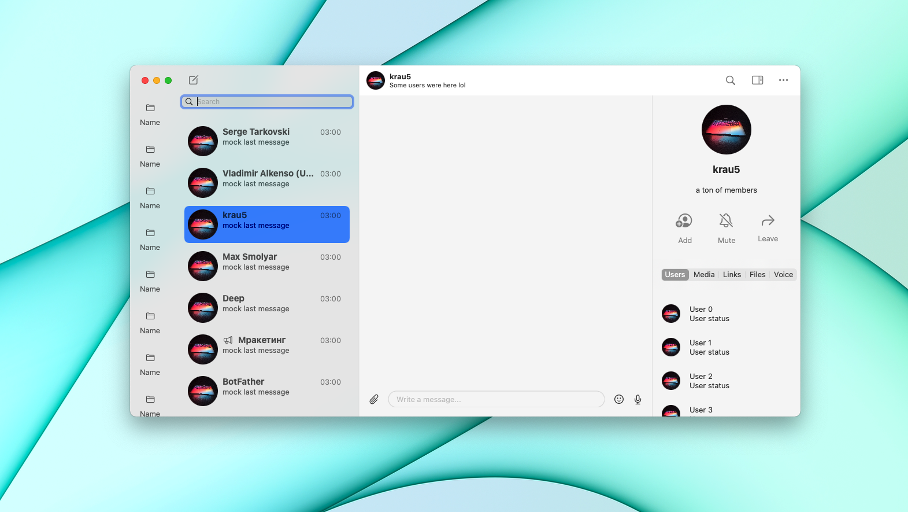
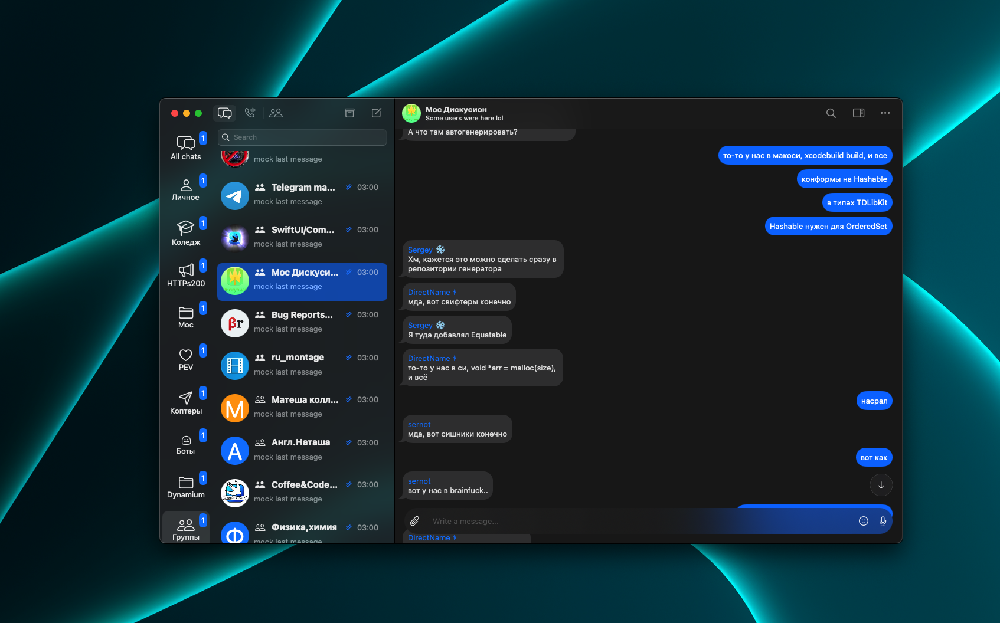

<p align="center">
  
</p>

<h1 align="center">Moc</h1>

<p align="center">
A (really) native and powerful macOS Telegram client, optimized
for moderating large communities and personal use. 
</p>


[](https://github.com/ggoraa/moc/actions/workflows/build.yml)
[](https://opensource.org/licenses/)
[]() 

This client is currently **in development** and **barely usable**. You can track progress by observing the [project table](https://github.com/users/ggoraa/projects/1/views/4), [issues](https://github.com/ggoraa/moc/issues), [pull requests](https://github.com/ggoraa/moc/pulls), and a [Telegram channel](https://t.me/moc_updates_ru) (russian).

Project roadmap: [Craft](https://www.craft.do/s/rmUOSbIPXTVbCY)

If you have any questions, ask them in [Discussions](https://github.com/ggoraa/moc/discussions) on GitHub, or in a [Telegram group](https://t.me/moc_discussion) (ukrainian/russian). You are **strongly** encoruaged to use Discussions and the Telegram group instead of Issues for questions. Bug reports and stuff go to Issues. There is a reason why GitHub created Discussions in the first place :D

# Screenshots



# Contributing

If you want to contribute a new feature, please make sure you have read the [project roadmap](https://www.craft.do/s/rmUOSbIPXTVbCY). This may guide you what are current goals of the project :D

# Building

## Step 1 - Download right version of Xcode

The development is going with Xcode 13.2. You can download it from
[Apple Developer](https://developer.apple.com/download/release/).

## Step 2 - Obtain `api_id` and `api_hash`

They can be obtained [here](https://my.telegram.org/). Log in, open **API development tools**, and fill up needed info. Then click **Save changes**
at the bottom of the page. Leave the page open, this will be needed in the next step!

## Step 3 - Set up development environment

Run this command:
```shell
./setup_environment.sh <api_id> <api_hash>
```

**Done!** You have everything set up. You can now build Moc 😁
