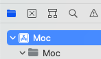
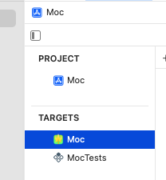
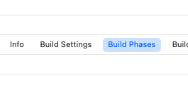
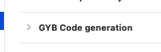
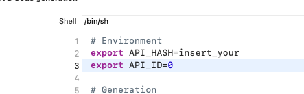

# Moc
A (really) native and powerful macOS Telegram client, optimized
for moderating large communities and personal use. 

# Screenshots
Will be available later! 📸

# Building

_Work in progress..._

## Step 1 - Download right version of Xcode

The development is going with Xcode 13.2. You can download it from
[Apple Developer](https://developer.apple.com/download/release/).

## Step 2 - Obtain `api_id` and `api_hash`

They can be obtained at my.telegram.org. Log in, open
**API devevelolment tools**, and fill up needed info. Then click **Save changes**
at the bottom of the page. Leave the page open, this will be needed in the next step!

## Step 3 - Set up development environment

Open the project in Xcode. Wait until all dependencies are resolved(it will take a while,
at least because of a 300~ MB TDLib build!)

After that, open Moc project from Project navigator:

Select `Moc` target:

Open `Build Phases` tab:

Expand `GYB Code generation` item:

And insert previously obtained` api_id` and `api_hash` in corresponding places:

**WARNING: DO NOT commit your `api_id` and `api_hash`. They should be kept private.**

**Done!** You have everything set up. You can now build Moc 😁
